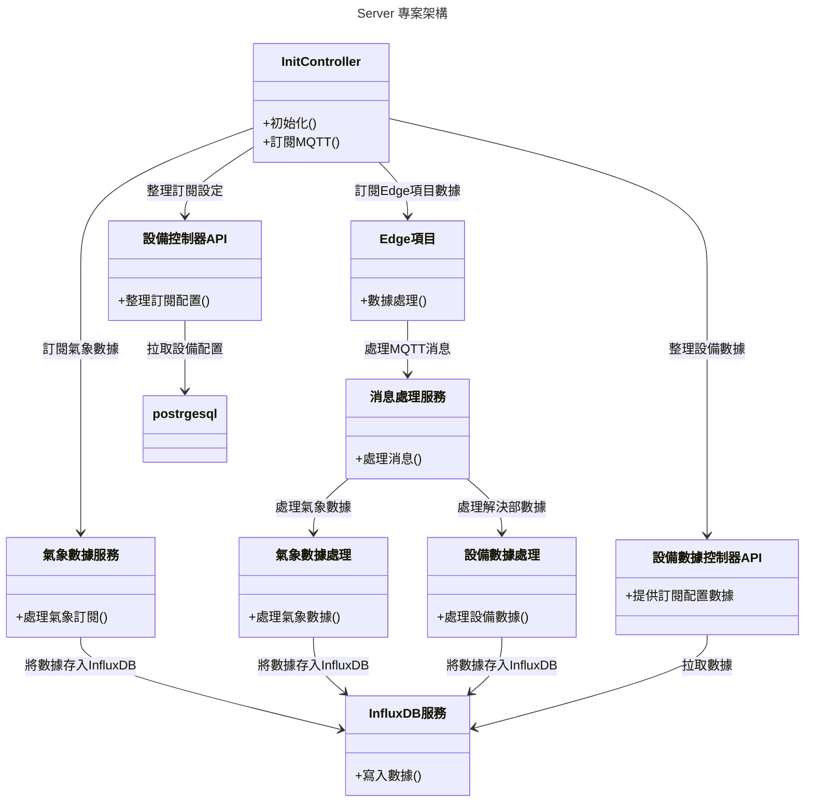

```
npm install
npm run format
npm run dev
```

```
GET http://localhost:3000/apibackend/device-data

GET http://localhost:3000/apibackenddevices_config

GET http://localhost:3000/fetch-all-weather


```


# Server 專案說明

## 項目簡介

本專案旨在管理和處理多源數據訂閱，特別是氣象數據和設備數據，並將其存儲至 InfluxDB 或 PostgreSQL。專案架構包括數據訂閱、數據處理、數據存儲及 API 接口等功能模塊。

## 架構圖

以下是系統的架構圖，幫助您更好地理解項目結構：



```angular2html

npx sequelize-cli db:migrate:undo
```


# 專案詳細說明
-- 
### Controllers
1. controllers/initController.ts: 負責初始化系統以及訂閱 MQTT 主題。包括氣象數據和 Edge 項目的數據訂閱及處理。 
## Services
1. services/weatherDataService.ts: 處理氣象相關的數據訂閱。從氣象站（小白屋）獲取氣象數據，並利用 MQTT 進行發布。
2. services/messageHandlerServices.ts: 處理通過 MQTT 接收到的消息，包含 weather 和 device 兩類消息。
3. services/influxServices.ts: 將整理好的數據存入 InfluxDB，便於後續查詢和分析。
### API
1. api/devicesController.ts: 為 Edge 專案提供數據訂閱的相關設置和整理好的信息。
2. api/deviceDataController.ts: 為需要使用的人提供從 InfluxDB 中拉取存儲數據的接口。
### Data Storage
1. InfluxDB: 用於存儲從各種來源獲取到的數據，包括氣象數據和設備數據。
2. PostgreSQL: 用於存儲和管理設備的訂閱設置信息。
